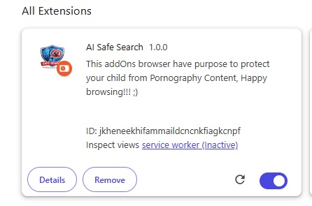
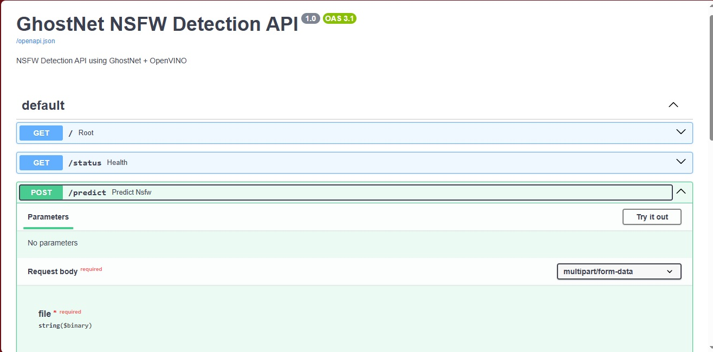
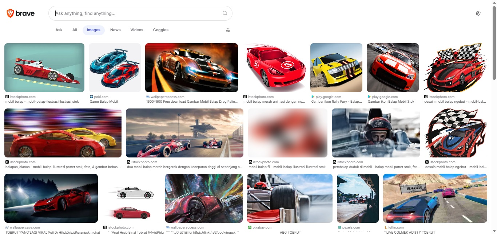

# Browser AddOns for Porn Detection using GhostNet
This is source code for Porn Detection addOns browser using GhostNet.

---

### Documentation







---

### Tech Stack
#### Runtime
- Python  
- Jupyter Notebook  

#### Deep Learning Framework
- `torch`
- `torchvision`
- `timm`
- `pytorch-lightning`
- `torchmetrics`

#### Data Processing & Image Processing
- `numpy`
- `opencv-python`
- `Pillow`

#### Machine Learning Utilities
- `scikit-learn`

#### Model Format & Interoperability
- `onnx`
- `onnxscript`

#### Inference Engine
- `openvino`
- `openvino-dev`

#### API Layer
- `fastapi`
- `uvicorn`
- `python-multipart`

#### System Architecture Layer
- AI Inference Engine (OpenVINO Runtime)
- REST API Service (FastAPI)
- Browser Extension Client
- Local AI Server
- Edge AI Deployment

#### Deployment Mode
- Local Server (Uvicorn)
- Local Inference Engine
- Edge Deployment (CPU Inference)
- Browser-based Client System

---

### Models
I was comparing the variant of CNN Modern and ViT model as:
| Model | Accuracy |
|------|-----------|
| CNN | 51% |
| EfficientNet V2 | 21% |
| MobileNet | 75% |
| Resnet | 57% |
| VGG16 | 72%* |
| **GhostNet** | **82.67%** |
| ViT-Ti/16 (Tiny) | 37% |
| DeiT-Tiny | 77% |
| Hybrid MobileNet-DeiT | 72% |

---

### Install dependencies
```text
pip install -r requirements.txt
```

---

### How to use
```text
Running api.py using command:
python -m uvicorn api:app --reload
```

---

### Flow Explanation

```text
1. scanImage()        → Browser scans all  elements in DOM
2. preBlur()          → Preventive soft blur (anti-flash protection)
3. API call           → Send image to FastAPI server
4. Model Inference    → GhostNet (OpenVINO runtime)
5. Class Detection    → porn / hentai / sexy classification
6. blurImage()        → Apply permanent blur
```

### Citation
```text
If you use this project in your research, academic work, thesis, or publication, please cite me, you can use Bibguru, etc
```
